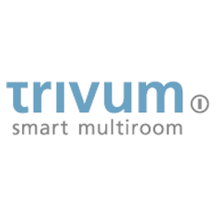

TR: # ioBroker.trivum
TR: **Tests:** 

TR: ## trivum adapter for ioBroker
TR: Trivum Multiroom System

TR: ## User manual
TR: Enter the IP address of the device in the main settings tab.
The adapter then automatically searches for the available zones and writes them with the associated objects in the object list.

TR: The following are created as general variables (global):

TR: -Turn everything off

TR: -Active zones (how many zones are currently on)

TR: Then the respective control elements under the individual zones:

TR: -Mute (mute and reactivate)

TR: -Defoult-Stream (activating the zone with the standard webstream)

TR: -Defoult tuner (activating the zone with the standard tuner)

TR: -Volume (display the volume and change it)

TR: -Zone-Off (switch off the zone)

TR: -Status of the zone (shows whether the zone is on or off)

## Changelog

### 0.0.4 (2021-06-12)
* (TheBam) Paging added and info.connection fixed for admin 5

### 0.0.3 (2021-04-29)
* (TheBam) Cleaning the code

### 0.0.2
* (TheBam) Cleaning the code

### 0.0.1
* (TheBam) First version to control your Trivum Multiroom Systems

## License
MIT License

Copyright (c) 2021 TheBam <elektrobam@gmx.de>

Permission is hereby granted, free of charge, to any person obtaining a copy
of this software and associated documentation files (the "Software"), to deal
in the Software without restriction, including without limitation the rights
to use, copy, modify, merge, publish, distribute, sublicense, and/or sell
copies of the Software, and to permit persons to whom the Software is
furnished to do so, subject to the following conditions:

The above copyright notice and this permission notice shall be included in all
copies or substantial portions of the Software.

THE SOFTWARE IS PROVIDED "AS IS", WITHOUT WARRANTY OF ANY KIND, EXPRESS OR
IMPLIED, INCLUDING BUT NOT LIMITED TO THE WARRANTIES OF MERCHANTABILITY,
FITNESS FOR A PARTICULAR PURPOSE AND NONINFRINGEMENT. IN NO EVENT SHALL THE
AUTHORS OR COPYRIGHT HOLDERS BE LIABLE FOR ANY CLAIM, DAMAGES OR OTHER
LIABILITY, WHETHER IN AN ACTION OF CONTRACT, TORT OR OTHERWISE, ARISING FROM,
OUT OF OR IN CONNECTION WITH THE SOFTWARE OR THE USE OR OTHER DEALINGS IN THE
SOFTWARE."# ioBroker.trivum"