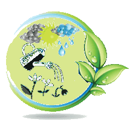
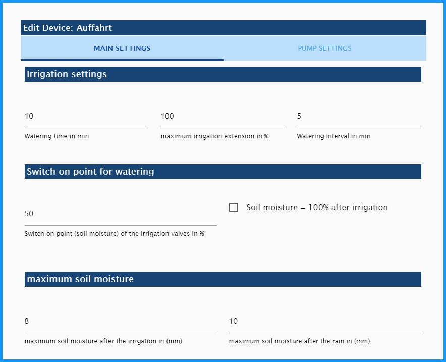
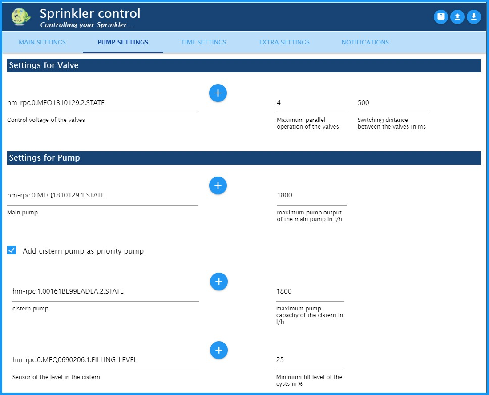
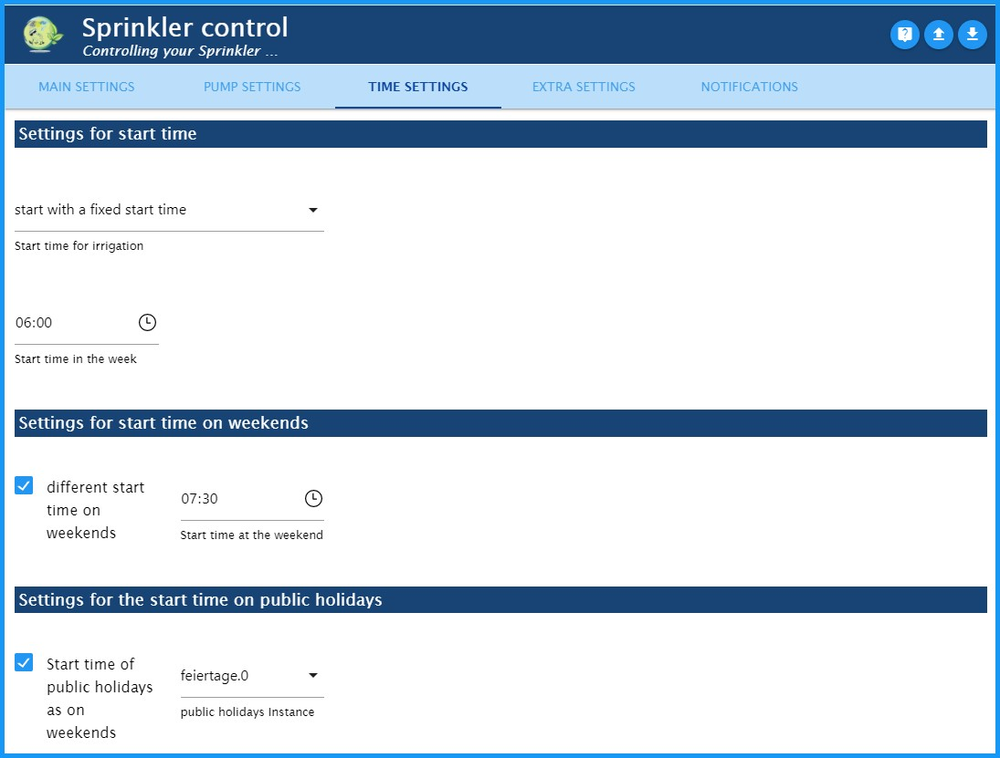
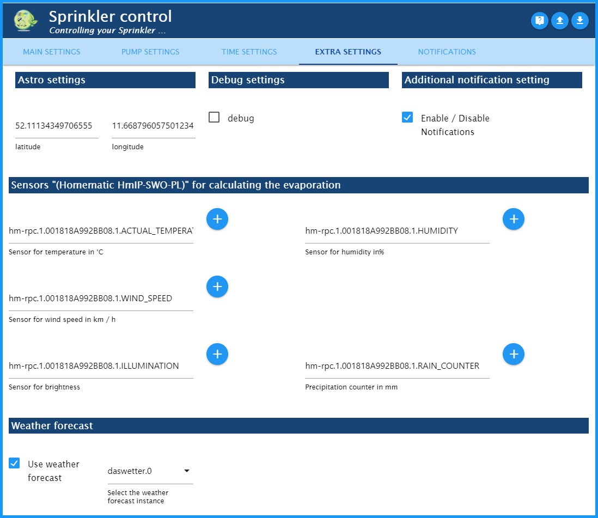
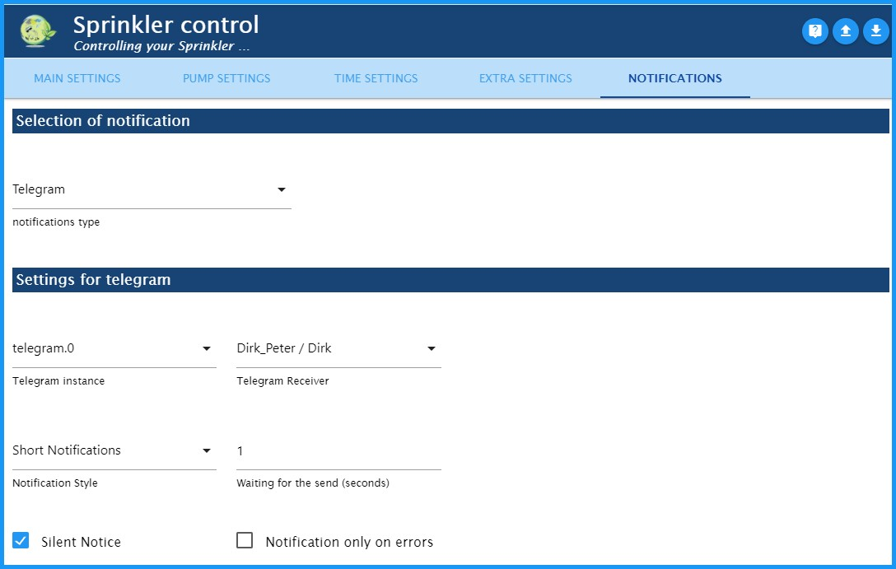
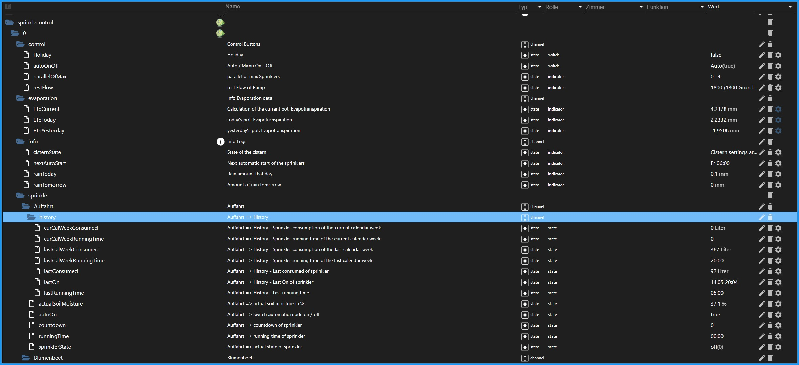

TR: # SprinkleControl
TR: ### *The adapter for weather-dependent automatic garden irrigation.* (by means of a weather sensor HmIP-SWO-PL – plus)
TR: Unfortunately my knowledge of English is too small for an adapter description.
I would be very grateful for any help with the translation.

---
---

TR: ## Mode of action
- - -

TR: The ambient data (temperature, humidity, brightness, wind speed, amount of rain) are evaluated in Sprinkle Control.
The evaporation determined in this way is used to determine the theoretical soil moisture of the individual irrigation areas.
At a point in time specified under "Time settings", the watering circuits that fall below a certain percentage are activated.
These different irrigation circuits are then controlled in such a way that the maximum pump output (l / h), and the maximum number of irrigation circuits are not exceeded.
Both are customizable.

TR: **Example for a switching behavior on a day (start time of all valves: 6:00)**

TR: My irrigation works with the Homematic IP weather sensor plus (HmIP-SWO-PL) and **was only tested with this**.
In the ioBroker forum, however, there are also some tests that are carried out with weather stations via the Sainlogic adapter.

---
---

TR: ## Installation
- - -

TR: An instance of the Sprinkle Control Adapter is installed through the ioBroker Admin interface by clicking the plus sign (+).
Depending on the active repository specified in the Admin adapter, the stable (default) or beta version (latest) will be installed.

---
---

TR: ## Adapter configuration - MAIN SETTINGS
- - -

TR: * 1: Go to the Sprinkle Control page on GitHub
TR: * 2: Load the adapter configuration from a file
TR: * 3: Save the adapter configuration from a file
TR: * 4: Add a new watering circle
TR: * 5: Check box to enable / disable the irrigation circuit
TR: * 6: The name of the irrigation circle is automatically read from the objects when the ID is selected and can then be changed as required.
TR: * 7: Unique ID of the data point to be controlled in the objects
TR: * 8: Change the selected irrigation actuator
TR: * 9: Open the individual configuration of the respective irrigation circuit
TR: * 10: Move the line position
TR: * 11: Delete watering circuit with all configured data!

- - -

TR: ### Individual configuration of an irrigation circuit
- - -

TR: Open the individual configuration of the respective irrigation circuit

TR: **Irrigation settings**

TR: - *Watering time in min:* Set the watering time in minutes. This lengthens the further the trigger falls below the "lowest percentage of soil moisture".
TR: - *maximum irrigation extension in %:* Limitation of the irrigation duration in percent (100% = irrigation duration is not extended).
TR: - *Watering interval in min:* The watering time is divided into an interval. (e.g. 5 minutes on, at least 5 minutes off, 5 minutes on, etc.)
TR:     - **Hint:** With me, I have a lawn grate at the entrance. Here the water only runs down the slope when it is irrigated. I was able to counteract this by pouring at intervals.

TR: **Switch-on point for watering**

TR: - *Switch-on point (soil moisture) of the irrigation valves in %:* Switch-on threshold: If this value is not reached, watering begins with the start time.
TR: - *Soil moisture = 100% after irrigation:* When activated, the soil moisture is set to 100% after watering. Otherwise, it will stay just below it due to evaporation during irrigation.

TR: **maximum soil moisture**

TR: - *maximum soil moisture after the irrigation in (mm):* Maximum theoretical water content in the soil after irrigation. The higher this value, the longer the watering intervals.
TR:   - **Hint:** Lawn grid: 5; Flowerbed: 10; Lawn area: 14
TR: - *maximum soil moisture after the rain in (mm):* Maximum theoretical water content in the soil after heavy rain. This value must be greater than after irrigation!
TR:   - **Hint:** Lawn grid: 6; Flowerbed: 15; Lawn area: 19

- - -

TR: #### Individual configuration of an irrigation circuit - MAIN SETTINGS
- - -

TR: **Sprinkler consumption**

TR: - *Flow amount in l/h:* Specific flow rate of the current irrigation station
TR:     - **Hint:** is often found in the instruction manual or on the Internet
TR: - *Booster:* Removes all active irrigation circuits from the network for 30 s and then switches them on again
TR:     - **Hint:** My pump delivers a maximum of 1800 l/h, and my lawn sprinklers need 1400 l/h, but full pressure, to start them. With the booster function, I can also water my conifers with a drip line that only needs 300 l / h.

TR:     > - **Danger:** This function should be used very sparingly, as only one irrigation circuit can water with an active booster at a time.

- - -

TR: #### Individual configuration of an irrigation circuit - PUMP SETTINGS
- - -

TR: **Settings for Valve**

TR: - *Control voltage of the valves:* Clicking the (+) symbol opens the Select-ID State window. Here you can select the STATE for the control voltage of the valves. This output becomes active as soon as one of the valves is active.

TR:   If you do not need this STATE, leave this field blank!

TR: - *Maximum parallel operation of the valves:* The number of active valves can be limited here. For example, if the output of the control transformer is not sufficient to switch several valves in parallel.
TR: - *Switching distance between the valves in ms:* Enter a time in milliseconds. This is the waiting time until the next valve is switched, which means, for example, that 6 outputs are switched one after the other and not simultaneously.

TR: **Settings for Pump**

TR: - *Main pump:* Clicking the (+) symbol opens the Select ID window. The CONDITION of the pump that is responsible for the water supply is saved here.
TR: - *maximum pump output of the main pump in l/h:* The maximum pump output is saved here. This then limits the irrigation circuits so that enough pressure is still applied to the valves.
TR:   - **Danger:** The actual pump output must be specified here. Not the one on the nameplate. For example, I have a "Gardena 5000/5 LCD" which, due to the length of the line, only generates an output of 1800 l / h and not 4500 l / h, as stated on the type plate.

TR: **Add cistern pump**

TR: - *Add cistern pump as priority pump*
TR:     - *cistern pump:* The cistern pump is entered here. This is deactivated if the level in the cistern is too low. In this case the main pump continues to water.
TR:     - *maximum pump capacity of the cistern in l/h:* The maximum pump output in l / h is saved here. See Adjusting the Main Pump.
TR:     - *Sensor of the level in the cistern:* STATE of the level sensor to determine the level in 0 ... 100%.
TR:       - *built-in:* Hm-Sen-Wa-Od Capacitive level meter from HomeMatic.
TR:     - *Minimum fill level of the cysts in %:* If this is not reached, the switching point is switched to the main pump and the valves are adjusted according to the amount consumed while the watering is running.

---
---

TR: ## Adapter configuration - TIME SETTINGS
- - -

TR: The start times for the sprinkle control can be set on this tab.

TR: ###Settings for start time
TR: - *Start time for irrigation:*
TR:   - *Start with a fixed start time:* The **Start time of the week** can be set here.
TR:   - *Start time at sunrise:* Here is the start time at sunrise. It can be shifted from -120 min to + 120 min via **Time shift in min**.
TR:   - *Start time at the end of the golden hour:*

TR: ###Settings for start time on weekends
TR: - *different start time on weekends:* If you want to start watering at a different time on the weekend so as not to annoy your neighbors, for example, you can activate it here.
TR: - *Start time at the weekend:*

TR: ###Settings for the start time on public holidays
TR: - *Start time of public holidays as on weekends:* If public holidays should be treated like weekends, this can be activated here.
TR: - *public holidays Instance* The external public holiday instance must then be selected here (for example the adapter "Deutsche Feiertage").

---
---

TR: ## Adapter configuration - EXTRA SETTINGS
- - -

TR: ### Astro settings
TR: SprinkleControl takes the latitude and longitude from the ioBroker system settings.
SprinkleControl uses these values to calculate the position of the sun and the extraterrestrial radiation for evaporation.

TR: ### Debug settings
TR: When activated, additional information is displayed in the log. This allows errors to be analyzed more quickly.

TR: ### Additional notification setting
TR: Activate the Notifications tab. The communication settings are then made on the new Notifications tab.

TR: ### Sensors "(Homematic HmIP-SWO-PL)" for calculating the evaporation
TR: > - **Danger:** The program is adapted to the "HomeMatic weather station HmIP-SWO-PL" for calculating the evaporation! Without this data, no irrigation circuits are triggered.

TR: - But I heard from the forum that the program also works with weather data via the "Sainlogic Adapter".
TR: - The sensors calculate the maximum possible evaporation of the potential evapotranspiration according to Penman ETp and thus control the irrigation system.

TR:   This happens every time the temperature changes.

TR: ### Weather forecast
TR: - If you activate the "Use weather forecast" box, a selection box will appear. Here the instance of the adapter "Das Wetter" must be selected.

TR: "Path 2: XML file with 5-day weather forecast and detailed information for every 3 hours" must be filled out in the "Das Wetter" adapter so that SprinkleControl can access the object **"daswetter.0.NextDaysDetailed.Location_1.Day_1.rain_value"**. This value is then used to postpone watering when it is supposed to rain.

---
---

TR: ## Adapter configuration - NOTIFICATIONS
- - -

TR: - Once the NOTIFICATIONS tab has been activated, you can choose your notification method and enter your details here.

---
---

TR: ## Admin => Objekte => sprinklecontrol.0.
- - -

TR: ### control
TR: - **Holiday:** If the "Holiday" is set to true, watering will start like the weekend if the weekend setting is enabled. A connection with a calendar would also be possible here.
TR: - **autoOnOff:** When the setting is "Off", the automatic mode of the irrigation system is disabled.
TR: - **parallelOfMax:** For example (3: 4). Three of four possible irrigation circles are active here. (This is just an ad!)
TR: - **restFlow:** Display of the possible residual flow of the pump. (This is just an ad!)

TR: ### evaporation
TR: - **ETpCurrent:** This is the current evaporation as a daily value in mm / day.
TR: - **ETpToday:** The current daily value of evaporation is displayed here. This will be moved to ETpYesterday at 00:05 and then reset to 0.
TR: - **ETpYesterday:** Yesterday's evaporation is shown here.

TR: ### info
TR: - **cisternState** If necessary, the status of the cistern and its status are displayed here.
TR: - **nextAutoStart** Indicates the next start of the irrigation system.
TR: - **rainToday** The precipitation forecast for today is displayed here. The adapter "the weather" is necessary for this.
TR: - **rainTomorrow** Precipitation forecast for tomorrow from the adapter "the weather".

TR: ### sprinkle.*.
TR: - **history**
TR:   - **curCalWeekConsumed:** Current weekly consumption of the irrigation circuit in liters
TR:   - **curCalWeekRunningTime:** current total weekly running time of the irrigation circuit
TR:   - **lastCalWeekConsumed:** last weekly consumption in liters of the irrigation circuit
TR:   - **lastCalWeekRunningTime:** last weekly total run time of the watering cycle
TR:   - **lastConsumed:** Water consumption during the last watering in liters
TR:   - **lastOn:** last start of the watering cycle (05.07 14:14)
TR:   - **lastRunningTime:** last watering duration
TR: - **actualSoilMoisture** This is the current virtual soil moisture in % => trigger criterion (max. 100% after irrigation, over 100% after heavy rain). Attention: This value can differ considerably from the actual soil moisture.
TR: - **autoOn** Automatically on (Here you can switch off the automatic watering of this circuit, e.g. during a repair, whereby manual watering is possible at any time.)
TR: - **countdown** Remaining watering time
TR: - **runningTime** Watering duration
TR:   - If a number greater than 0 is entered here, the watering cycle begins for the specified time in minutes.
TR:   - If you enter a 0, the watering of the watering circle will be ended.
TR: - **sprinklerState** Display of the status of the irrigation circuit.
TR:   - off(0) → Irrigation circuit off.
TR:   - wait(1) → The irrigation circuit is waiting for the pump capacity to become available.
TR:   - on(2) → Irrigation circle on.
TR:   - break(3) → The watering cycle was interrupted (configuration, watering interval)
TR:   - Boost(4) → The boost function of the current irrigation circuit is active (configuration, booster on).
TR:   - off(Boost)(5) → Irrigation circuit interrupted for 30 s because a boost function is active.

## Changelog

<!--
	Placeholder for the next version (at the beginning of the line):
	### **WORK IN PROGRESS**
-->

### 0.1.7 (22.05.2021)
* (Dirk-Peter-md) Beschreibung in englischer Sprache hinzugefügt
* (Dirk-Peter-md) bereit für stable

### 0.1.6 (18.05.2021)
* (Dirk-Peter-md) AutoOn-Schalter pro Bewässerungskreis hinzugefügt
* (Dirk-Peter-md) weitere Fehler beseitigt (js-Controller)
* (Dirk-Peter-md) Niederschlagszähler von der Verdunstung gelöst

### 0.1.5 (05.05.2021)
* (Dirk-Peter-md) Zurücksetzen der Regenmenge im 24-Stunden-Modus hinzugefügt

### 0.1.4 (21.04.2021)
* (Dirk-Peter-md) Fehler bei deaktivierter Wettervorhersage behoben

### 0.1.3 (18.04.2021)
* (Dirk-Peter-md) Schaltabstand zwischen den Ventilen eingebaut, main.js aufgeteilt

### 0.1.2 (30.12.2020)
* (Dirk-Peter-md) Beschreibung von SprinkleControl überarbeitet

### 0.1.1 (08.11.2020)
* (Dirk-Peter-md) Integration von Nachrichten per Telegramm, E-Mail, Pushover und WhatsApp

### 0.0.12 (10.10.2020)
* (Dirk-Peter-md) Bewässerung über eine 2. Pumpe (Zisterne mit Vorrangschaltung) in abhängigkeit vom Füllstand hinzugefügt.

### 0.0.11 (30.08.2020)
* (Dirk-Peter-md) Bug in der Verarbeitung der Regenvorhersage vom Adapter "Das Wetter"
* (Dirk-Peter-md) Bug auf Travis CI

*************************************************************************************************************************************

## License
MIT License

Copyright (c) 2021 Dirk Peter <dirk.peter@freenet.de>

Permission is hereby granted, free of charge, to any person obtaining a copy
of this software and associated documentation files (the "Software"), to deal
in the Software without restriction, including without limitation the rights
to use, copy, modify, merge, publish, distribute, sublicense, and/or sell
copies of the Software, and to permit persons to whom the Software is
furnished to do so, subject to the following conditions:

The above copyright notice and this permission notice shall be included in all
copies or substantial portions of the Software.

THE SOFTWARE IS PROVIDED "AS IS", WITHOUT WARRANTY OF ANY KIND, EXPRESS OR
IMPLIED, INCLUDING BUT NOT LIMITED TO THE WARRANTIES OF MERCHANTABILITY,
FITNESS FOR A PARTICULAR PURPOSE AND NON INFRINGEMENT. IN NO EVENT SHALL THE
AUTHORS OR COPYRIGHT HOLDERS BE LIABLE FOR ANY CLAIM, DAMAGES OR OTHER
LIABILITY, WHETHER IN AN ACTION OF CONTRACT, TORT OR OTHERWISE, ARISING FROM,
OUT OF OR IN CONNECTION WITH THE SOFTWARE OR THE USE OR OTHER DEALINGS IN THE
SOFTWARE.